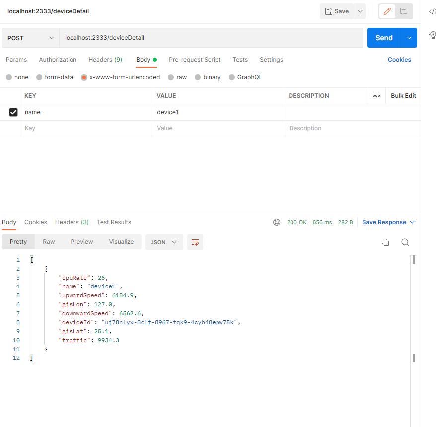

## 后端

### service app 
├─src</br>
│  └─main</br>
│      ├─dataMaker</br>
│      ├─in</br>
│      ├─java</br>
│      │  ├─database 数据库相关</br>
│      │  └─service 启动即可测试api（记得导入包）</br>
│      ├─out</br>
│      └─resources</br>
└─target</br>
├─classes</br>
│  ├─database</br>
│  └─service</br>
└─generated-sources</br>
└─annotations</br>


- [x] 获取api的函数
- [x] 生成和整理数据，扔给前端(数据还剩下路径没造，明天（今天）早上思考一下咋弄:)
- [x] sql~>api处理后的数据和注册登录
- [ ] 地图&&路径
- [x] 伪造接口
- [x] RESEfulAPI获取函数

获取华为API的函数在 *service/RESTAPI*

数据库在 *service/mysql/EP1.sql* (先create database EP1; use EP1;)

后端接口 *service/app/src/main/java/service/controller.java*

前端接口? *web/api.js*




### 数据约束（表）

- *deviceDetail* 从后端获取设备详细信息 100行

  ```
  deviceId: 设备Id
  name：设备名
  gisLon：经度
  gisLat：纬度
  traffic：流量
  upwardSpeed：上行速率
  downwardSpeed：下行速率
  cpuRate：cpu占有率
  ```

- *deviceTraffic* 查询设备1h内的上行流量、下行流量 6行

  ```
  deviceId：设备ID
  deviceName：设备名
  upTraffic：上行流量
  downTraffic：下行流量
  unit：流量单位
  ```

- *histFlow* 历史人流量 168条，以h为单位，24*7 170行
- *nowFlow* 当前人流量 3600条，以s为单位，3600s，动态演示 1200行
- *siteFlow* 站点人流量 6条，2022-07-02 13:00:00这一时刻6个景点的人数（想要加多点也可以叫我加） 6行

这三个参数是一样的，时间默认从2022-07-02 13:00:00开始。

- ```
  siteId:站点Id
  humanFlow:人流量
  reVisitedRate:重复访问率
  stamp:时间戳（可以搜时间戳转换工具将其转换成正常的时间）
  ```

- *siteHealth* 查询站点&&设备健康度 100行

  ```
  siteId：站点id
  deviceHealth：设备健康度
  radioHealth：射频健康度
  siteHealth：站点健康度
  ```

- *siteUserNumber* 500行

  ```
  siteId：站点id
  exprWorse：体验差的用户（终端）数
  exprBad：体验一般的用户（终端）数
  exprGood：体验良好的用户（终端）数
  exprBetter：体验佳的用户（终端）数
  oneHour：在线一小时以内的用户（终端）数
  oneToTwoHour：在线一到两小时的用户（终端）数
  twoToFourHour：在线两到四小时的用户（终端）数
  fourToSixHour：在线四到六小时的用户（终端）数
  sixToEightHour：在线六到八小时的用户（终端）数
  eightHour：在线八小时以上的用户（终端）数
  ```

- *siteWlan*  查询站点的上行速率、下行速率 6行

  ```
  siteId：站点id
  timestamp：时间戳
  unit：单位
  uplinkRate：上行速率
  downlinkRate：下行速率
  ```

- *user*  用户信息（mac地址的延伸） 6行

  ```
  userId：用户id
  username: 用户名
  phoneNumber：电话
  address：地址
  sex：性别
  phoneType：手机型号
  ```
### 伪接口（无交互，后端运行之后vue应该可以直接通过http的get请求获得数据）

```
localhost:2333/ 							 
localhost:2333/hello 					 
localhost:2333/deviceDetail		
localhost:2333/deviceTraffic	
localhost:2333/histFlow        
localhost:2333/nowFlow         
localhost:2333/siteFlow        
localhost:2333/siteHealth      
localhost:2333/siteUserNumber  
localhost:2333/siteWlan        
localhost:2333/user        
```

用到的华为RESEful接口：

```
1. 获取设备标签
class Tags
public DeviceGroupTagResp getDeviceGroupTags(String siteId, Integer pageSize, Integer pageIndex)
返回的主要参数
tagId：标签ID
tagName：标签名
2. 查询实时接入客户数量
class RealtimeFlow
public FlowDistrResp getRealtimeFlowDistr(String siteId, String tagId)
返回的主要参数
humanflow：客流量
	count：具体数值
	stamp：时间戳
	
3. 查询历史接入客户数量
class HistoryFlow
public FlowDistrResp getHistoryFlowDistr(String siteId, Long startTime, Long endTime, String tagId)
返回的主要参数
humanflow：客流量
	count：具体数值
	stamp：时间戳
	
4. 查询回头客记录
class Loyalty
public FlowDistrResp queryLoyaltyDistr(String tagId, String tagType, Integer startTime, Integer endTime, String timeUnit)
返回的主要参数
humanflow：客流量
	count：具体数值
	stamp：时间戳
repeat_rate：重复访问率
	count：具体数值
	stamp：时间戳

5. 查询站点维度TopN设备或者所有设备的上行流量、下行流量
class DeviceTraffic
public DeviceTrafficStatisticResp queryDeviceTraffic(UUID siteId, String timeDimension, Integer top, Long beginTime, Long endTime)
返回的主要参数
deviceId：设备ID
deviceName：设备名称
upTraffic：上行流量
downTraffic：下行流量
unit：流量单位

6. 基于站点的站点健康度查询
class SiteHealth
public querySiteHealthList(String siteId)
返回的主要参数
siteId：站点ID
deviceHealth：设备健康度
radioHealth：射频健康度
siteHealth：站点健康度
7. 查询TOP N SSID流量和最近在线用户数
class TopNSsidTraffic
public queryTopNSSIDTraffic(String siteId,Long beginTime,Long endTime, String timeGranularity,String top,String deviceType)
返回的主要参数
ssidName：SSID名称。
ssidTraffic：SSID流量。
onlineUsers：在线用户数。
8. 查询访客驻留时长的历史趋势
class DwellTime
public FlowDistrResp queryDwellTimeDistr(String tagId, String tagType, Integer startTime, Integer endTime, String timeUnit)
返回的主要参数
within_one_hr：驻留时长小于一小时的客户数量。
  count：具体数值
	stamp：时间戳
within_one_hr
	count：具体数值
	stamp：时间戳
within_one_hr
	count：具体数值
	stamp：时间戳
9. 查询站点维度下用户在线时长信息
class TerminalStatistics
public queryTerminalStatistics(String siteId)
返回的主要参数
exprWorse：体验-差的终端个数。该字段始终为0。
exprBad：体验-一般的终端个数。体验一般的标准为，丢包率大于等于5%。
exprGood：体验-良好的终端个数。体验良好的标准为，丢包率大于等于3%且小于5%。
exprBetter：体验-优的终端个数。体验优的标准为，丢包率小于3%。
speedBad：速度-慢的终端个数。速度慢的标准为，速度小于11Mbps。
speedGood：速度-中的终端个数。速度中的标准为，速度大于等于11Mbps且小于等于54Mbps。
speedBetter：速度-快的终端个数。速度快的标准为，速度大于54Mbps。
oneHour：在线一小时的终端数。
oneToTwoHour：在线一至二小时的终端数。
twoToFourHour：在线二至四小时的终端数。
fourToSixHour：在线四至六小时的终端数。
sixToEightHour：在线六至八小时的终端数。
eightHour：在线八小时以上的终端数。
10. 查询单设备的性能数据
class DeviceDetail
public DevicePerformanceResp singleDevicePerformanceDetail(UUID deviceId) 
返回的主要参数
esn：设备ESN号
deviceIp： 设备IP。
gisLon： 设备位置经度。
gisLat： 设备位置纬度。
traffic：总流量，单位：字节。
onlineUsers：终端连接数。
cpuRate：CPU利用率，单位：百分比。
upwardSpeed：上行速率，单位：bps。
downwardSpeed：下行速率，单位：bps。
11. 查询位置信息
class LbsDataRelayApplication
public StationDataResp querySiteStationInfo(UUID siteId, Integer pageIndex, Integer pageSize, String status, String terminalMac, String terminalIP, String ssid, String sortKey, String account)
返回的主要参数：
terminalMac：终端的Mac地址
rssi：信号强度
timestamp：时间戳
apMac：AP的Mac地址
secret：校验密码
type：类型
```


## 使用方法：
1. 打开mysql服务器并根据service/mysql/EP1.sql文件建相关的表
2. 配置service/app/src/main/resources/jdbc.properties中的自己的mysql密码(pwd)和账户名(user)
3. 运行service/app/src/main/java/service/controller.java文件，以打开后端调用的相关端口
4. 在web目录下执行以下命令：
* npm i
* npm run lint --fix
* npm run serve
* 打开 http://localhost:81/# 即可看到首页。
